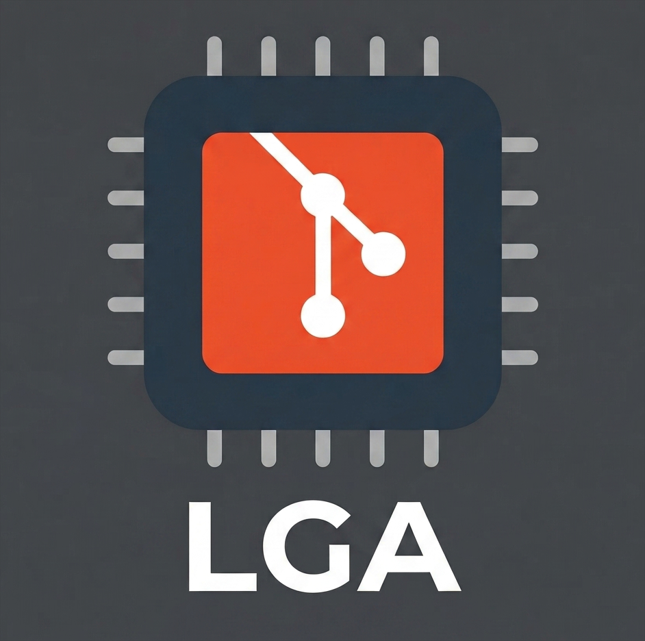

<p align="center">
  
</p>

<h1 align="center">Logical Git Aliases</h1>

<p align="center">A prefix-based shorthand system that turns Git commands into muscle memory.</p>

Two-letter **prefix** picks the command. One-letter **suffix** is the first letter of the flag.

```
git st  → status                git cm  → commit
git sts → status --short        git cmm → commit --message
                                git cma → commit --amend
git df  → diff
git dfc → diff --cached         git rb  → rebase
git dfi → diff --ignore-space   git rba → rebase --abort
                                git rbi → rebase --interactive
git ps  → push
git psf → push --force          git mg  → merge
git psh → push origin HEAD      git mga → merge --abort
                                git mgc → merge --continue
```

That's it. `rbc`? **r**e**b**ase --**c**ontinue. `psf`? **p**u**s**h --**f**orce. `dfc`? **d**i**f**f --**c**ached.

Run `git lga` to see every alias right in your terminal:

```
╔═════════════════════════════════════════════════╗
║                   Git Aliases                   ║
╠═════════════════════════════════════════════════╣
║ ── A ──                                         ║
║ ad     │ add                                    ║
║ ada    │ add .                                  ║
║ adu    │ add --update                           ║
║ ── B ──                                         ║
║ bl     │ blame                                  ║
║ br     │ branch                                 ║
║ brd    │ branch --delete                        ║
║ brl    │ branch --list                          ║
║ ── C ──                                         ║
║ cm     │ commit                                 ║
║ cmm    │ commit --message                       ║
║ cma    │ commit --amend                         ║
║ cmn    │ commit --amend --no-edit               ║
║ cmf    │ commit --fixup                         ║
║ ck     │ checkout                               ║
║         ...                                     ║
║ ── S ──                                         ║
║ st     │ status                                 ║
║ sts    │ status --short --branch                ║
║ sw     │ switch                                 ║
║ swc    │ switch --create                        ║
║ sth    │ stash                                  ║
║ stha   │ stash apply                            ║
║ sthd   │ stash drop                             ║
║         ...                                     ║
╚═════════════════════════════════════════════════╝
  71 aliases across 13 groups
```

## Install

**Linux / macOS:**

```bash
curl -sL https://raw.githubusercontent.com/rockberpro/git-lga/main/setup.sh | bash
```

**Windows (PowerShell):**

```powershell
irm https://raw.githubusercontent.com/rockberpro/git-lga/main/setup.ps1 | iex
```

The setup script only adds an `[include]` entry to `~/.gitconfig` and copies two files to `~/`. You can read the full source ([setup.sh](setup.sh), [setup.ps1](setup.ps1)) before running it, or use the manual install below.

**Manual install:**

```bash
curl -sL https://raw.githubusercontent.com/rockberpro/git-lga/main/git-lga.gitconfig \
  -o ~/.git-lga.gitconfig

curl -sL https://raw.githubusercontent.com/rockberpro/git-lga/main/git-lga-help.sh \
  -o ~/.git-lga-help.sh && chmod +x ~/.git-lga-help.sh

git config --global include.path ~/.git-lga.gitconfig
```

## The Pattern

Every alias follows the same rule: **prefix** (2–3 letters from the command name) + **suffix** (first letter of the key flag).

| Prefix | Command     | Variants                                                                                   |
| ------ | ----------- | ------------------------------------------------------------------------------------------ |
| `ad`   | add         | `ada` all, `adu` update                                                                    |
| `br`   | branch      | `brd` delete, `brl` list                                                                   |
| `cm`   | commit      | `cmm` message, `cma` amend, `cmn` no-edit, `cmf` fixup                                     |
| `ck`   | checkout    | —                                                                                          |
| `sw`   | switch      | `swc` create                                                                               |
| `rs`   | restore     | `rsa` all, `rss` staged                                                                    |
| `df`   | diff        | `dfc` cached, `dfi` ignore-space, `dfw` word-diff                                          |
| `ft`   | fetch       | `ftp` prune                                                                                |
| `pl`   | pull        | `plh` HEAD                                                                                 |
| `ps`   | push        | `psf` force, `psh` HEAD, `pshf` HEAD+force                                                 |
| `lg`   | log         | `lgp` patch, `lgo` oneline graph, `lgh` HEAD                                               |
| `sh`   | show        | —                                                                                          |
| `mg`   | merge       | `mga` abort, `mgc` continue, `mgs` squash                                                  |
| `rb`   | rebase      | `rba` abort, `rbc` continue, `rbi` interactive, `rbo` onto                                 |
| `sth`  | stash       | `stha` apply, `sthd` drop, `sthl` list, `stho` pop, `sthp` push, `sthc` clear, `sths` show |
| `st`   | status      | `sts` short                                                                                |
| `chp`  | cherry-pick | `cha` abort, `chc` continue                                                                |

**Other aliases:** `bl` blame, `cfg` config, `cfgl` config --list, `cln` clean, `clf` clean --force, `clo` clone, `ds` describe, `gp` grep, `in` init, `rt` remote, `rv` revert, `rst` reset, `tg` tag, `brs` show-current-branch.

**Built-in help:** `lga` — show all aliases in a formatted table.

## Why This One?

There are hundreds of git alias collections. Here's what makes this one different:

- **Learnable, not memorizable.** The prefix+suffix rule means you can _guess_ aliases you've never seen. Most collections are arbitrary shorthand you have to look up every time.
- **`git lga` built-in reference.** Forget an alias? One command shows them all, grouped and formatted, right in your terminal.
- **Non-invasive.** Installs as a gitconfig `[include]` — your existing config stays untouched. Remove it with one line.
- **No dependencies.** Pure gitconfig + one shell script. No plugin managers, no frameworks, no oh-my-zsh required.

## Uninstall

```bash
git config --global --unset include.path ~/.git-lga.gitconfig
rm ~/.git-lga.gitconfig ~/.git-lga-help.sh
```

---

[setup.sh](setup.sh) · [setup.ps1](setup.ps1) · [git-lga.gitconfig](git-lga.gitconfig) · [git-lga-help.sh](git-lga-help.sh)
